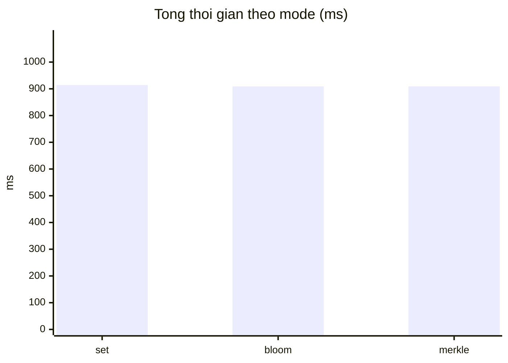

# Kết Quả Thực Nghiệm NIBSR

Tài liệu này được tạo tự động bởi `cargo run --bin cases`. Mỗi lần chạy sẽ ghi đè toàn bộ nội dung.

## Mục tiêu

Đánh giá các trường hợp VerifyR theo bài báo: chưa thu hồi, thu hồi, bỏ thu hồi, sửa dữ liệu, và ngoài cửa sổ hiệu lực.

## Mode: set

### Dữ liệu đầu vào cơ sở

- `now`: 1800000000
- `scope`: `wallet:pay:small`
- `not_before`: 1799999990
- `not_after`: 1800000010
- `pk_r` (hex): `b46d0a6291f042cd4e64e8e8843c1cbb9493b51dc3528b75d1576279a82f1e97bc093817fa2402ef65ab7b6642bb1309`
- `tau` (hex): `9c9e9bf60e1564460b9f05f54d5d87d2046d98609c623de2602c8569a4cf495b`
- `rev_digest_ban_dau` (hex): `75e7cdd03811e7bee9c891b84cabf7e3208e2d5bf0ddc99d22612be9e4638823`
- `message_sha256`: `daf2c6866f5ab0d7d12254a851c8f21871924ada311b9d7290c9f88fde618c90`
- `nibs_message_sha256`: `5da65492c854b191f580fd5fb72f7e64a7a1ca5aca9a201601f4caa1b10b5b95`
- `sigma_sha256`: `4cfdbdcfc8dd612b887d97cd6d54fb920155bc86fc5b0f2f7c89d7813c3ea6b3`

### Trình tự test Input -> Output

1. `Chua them vao RevList`
- Input: `action=none, verify_time=1800000000, rev_digest=75e7cdd03811e7bee9c891b84cabf7e3208e2d5bf0ddc99d22612be9e4638823`
- Output: `Accept`
- Thoi gian buoc: `143754` us

2. `Da them vao RevList (Add)`
- Input: `action=Add(id=b46d0a6291f042cd4e64e8e8843c1cbb9493b51dc3528b75d1576279a82f1e97bc093817fa2402ef65ab7b6642bb1309, tau=9c9e9bf60e1564460b9f05f54d5d87d2046d98609c623de2602c8569a4cf495b), verify_time=1800000000, rev_digest=9894e6c3253793244878264d1b15811132e83de3a866ee1c1686037620262728`
- Output: `RejectRevoked`
- Thoi gian buoc: `146557` us

3. `Da xoa khoi RevList (Remove)`
- Input: `action=Remove(id=b46d0a6291f042cd4e64e8e8843c1cbb9493b51dc3528b75d1576279a82f1e97bc093817fa2402ef65ab7b6642bb1309, tau=9c9e9bf60e1564460b9f05f54d5d87d2046d98609c623de2602c8569a4cf495b), verify_time=1800000000, rev_digest=75e7cdd03811e7bee9c891b84cabf7e3208e2d5bf0ddc99d22612be9e4638823`
- Output: `Accept`
- Thoi gian buoc: `144081` us

4. `Sua message credential`
- Input: `action=tamper_message, old_msg_sha256=daf2c6866f5ab0d7d12254a851c8f21871924ada311b9d7290c9f88fde618c90, new_msg_sha256=a38a4181b10da4b279e57b2734e1ec40438d372e328bfc3ebb17313801873d8a`
- Output: `RejectInvalid("invalid binding proof between pkR, nonce and final NIBS message")`
- Thoi gian buoc: `143192` us

5. `Sua tag credential`
- Input: `action=tamper_tag, old_tau=9c9e9bf60e1564460b9f05f54d5d87d2046d98609c623de2602c8569a4cf495b, new_tau=9d9e9bf60e1564460b9f05f54d5d87d2046d98609c623de2602c8569a4cf495b`
- Output: `RejectInvalid("invalid tag")`
- Thoi gian buoc: `148776` us

6. `Verify truoc not_before`
- Input: `verify_time=1799999900 (< not_before=1799999990)`
- Output: `RejectOutsideValidityWindow`
- Thoi gian buoc: `0` us

7. `Verify sau not_after`
- Input: `verify_time=1800000100 (> not_after=1800000010)`
- Output: `RejectOutsideValidityWindow`
- Thoi gian buoc: `0` us

### Hiệu năng theo giai đoạn

| Giai đoạn | Thời gian (us) |
|---|---:|
| Issue | 27705 |
| Obtain | 160280 |
| Tong 7 lan VerifyR | 726360 |
| Tổng mode | 914345 |

## Mode: bloom

### Dữ liệu đầu vào cơ sở

- `now`: 1800000000
- `scope`: `wallet:pay:small`
- `not_before`: 1799999990
- `not_after`: 1800000010
- `pk_r` (hex): `98eb86c2fea73b77b56eda389635ee291a13b1be4ef1809799806bdce28c4cc17d254f82b6b92b9feeb148a07b78c8d6`
- `tau` (hex): `c77e12a88bf8879b41f2ce9fa4ff5f83aea2c6e4f34833202093a54ec359ea05`
- `rev_digest_ban_dau` (hex): `2556a3c127d7634664140f1f3b8f755dbbd687dbafe53cf105dfe132653e24f0`
- `message_sha256`: `daf2c6866f5ab0d7d12254a851c8f21871924ada311b9d7290c9f88fde618c90`
- `nibs_message_sha256`: `10864a3bb0299506597fb0561cc700487fd7d655769ca6263f79f82f6ee155cf`
- `sigma_sha256`: `6e1b0c8ed812ba8ef5e257553c989ad1ed22a04106ed057505a19dbfc0025e52`

### Trình tự test Input -> Output

1. `Chua them vao RevList`
- Input: `action=none, verify_time=1800000000, rev_digest=2556a3c127d7634664140f1f3b8f755dbbd687dbafe53cf105dfe132653e24f0`
- Output: `Accept`
- Thoi gian buoc: `144334` us

2. `Da them vao RevList (Add)`
- Input: `action=Add(id=98eb86c2fea73b77b56eda389635ee291a13b1be4ef1809799806bdce28c4cc17d254f82b6b92b9feeb148a07b78c8d6, tau=c77e12a88bf8879b41f2ce9fa4ff5f83aea2c6e4f34833202093a54ec359ea05), verify_time=1800000000, rev_digest=9de461568db9349713d137bf6d52fe9e92d62bf1381ec27d3ba5a724509976a2`
- Output: `RejectRevoked`
- Thoi gian buoc: `144019` us

3. `Da xoa khoi RevList (Remove)`
- Input: `action=Remove(id=98eb86c2fea73b77b56eda389635ee291a13b1be4ef1809799806bdce28c4cc17d254f82b6b92b9feeb148a07b78c8d6, tau=c77e12a88bf8879b41f2ce9fa4ff5f83aea2c6e4f34833202093a54ec359ea05), verify_time=1800000000, rev_digest=2556a3c127d7634664140f1f3b8f755dbbd687dbafe53cf105dfe132653e24f0`
- Output: `Accept`
- Thoi gian buoc: `144796` us

4. `Sua message credential`
- Input: `action=tamper_message, old_msg_sha256=daf2c6866f5ab0d7d12254a851c8f21871924ada311b9d7290c9f88fde618c90, new_msg_sha256=a38a4181b10da4b279e57b2734e1ec40438d372e328bfc3ebb17313801873d8a`
- Output: `RejectInvalid("invalid binding proof between pkR, nonce and final NIBS message")`
- Thoi gian buoc: `143398` us

5. `Sua tag credential`
- Input: `action=tamper_tag, old_tau=c77e12a88bf8879b41f2ce9fa4ff5f83aea2c6e4f34833202093a54ec359ea05, new_tau=c67e12a88bf8879b41f2ce9fa4ff5f83aea2c6e4f34833202093a54ec359ea05`
- Output: `RejectInvalid("invalid tag")`
- Thoi gian buoc: `143945` us

6. `Verify truoc not_before`
- Input: `verify_time=1799999900 (< not_before=1799999990)`
- Output: `RejectOutsideValidityWindow`
- Thoi gian buoc: `0` us

7. `Verify sau not_after`
- Input: `verify_time=1800000100 (> not_after=1800000010)`
- Output: `RejectOutsideValidityWindow`
- Thoi gian buoc: `0` us

### Hiệu năng theo giai đoạn

| Giai đoạn | Thời gian (us) |
|---|---:|
| Issue | 26926 |
| Obtain | 161454 |
| Tong 7 lan VerifyR | 720492 |
| Tổng mode | 908872 |

## Mode: merkle

### Dữ liệu đầu vào cơ sở

- `now`: 1800000000
- `scope`: `wallet:pay:small`
- `not_before`: 1799999990
- `not_after`: 1800000010
- `pk_r` (hex): `97dde151442437dd3fc5c850a8f2ddee5a748a98814a61cd8bdd60724a52287d08bd6f0cdababc760ab248ed57e7055c`
- `tau` (hex): `79aa818bc83a2088734f54094dd3a20511e878ffc812113aa322e0cb751ed98e`
- `rev_digest_ban_dau` (hex): `f9ac9564bd23fb08e2009acbdec22f8b31aea240d1ca2052d66f92c99db94dc2`
- `message_sha256`: `daf2c6866f5ab0d7d12254a851c8f21871924ada311b9d7290c9f88fde618c90`
- `nibs_message_sha256`: `71cb4fa0ba4afe1182564128007197ef63a2ec6608fabf44826fc79ca228cc93`
- `sigma_sha256`: `800a9d903213e043bbae172bb604a045335c04dc3856b91b40a5880b22831193`

### Trình tự test Input -> Output

1. `Chua them vao RevList`
- Input: `action=none, verify_time=1800000000, rev_digest=f9ac9564bd23fb08e2009acbdec22f8b31aea240d1ca2052d66f92c99db94dc2`
- Output: `Accept`
- Thoi gian buoc: `143508` us

2. `Da them vao RevList (Add)`
- Input: `action=Add(id=97dde151442437dd3fc5c850a8f2ddee5a748a98814a61cd8bdd60724a52287d08bd6f0cdababc760ab248ed57e7055c, tau=79aa818bc83a2088734f54094dd3a20511e878ffc812113aa322e0cb751ed98e), verify_time=1800000000, rev_digest=4b8d9736170c05731f9a7745034baf65d3387c1f307c74c3b8b9aeeb868c246e`
- Output: `RejectRevoked`
- Thoi gian buoc: `142353` us

3. `Da xoa khoi RevList (Remove)`
- Input: `action=Remove(id=97dde151442437dd3fc5c850a8f2ddee5a748a98814a61cd8bdd60724a52287d08bd6f0cdababc760ab248ed57e7055c, tau=79aa818bc83a2088734f54094dd3a20511e878ffc812113aa322e0cb751ed98e), verify_time=1800000000, rev_digest=f9ac9564bd23fb08e2009acbdec22f8b31aea240d1ca2052d66f92c99db94dc2`
- Output: `Accept`
- Thoi gian buoc: `143069` us

4. `Sua message credential`
- Input: `action=tamper_message, old_msg_sha256=daf2c6866f5ab0d7d12254a851c8f21871924ada311b9d7290c9f88fde618c90, new_msg_sha256=a38a4181b10da4b279e57b2734e1ec40438d372e328bfc3ebb17313801873d8a`
- Output: `RejectInvalid("invalid binding proof between pkR, nonce and final NIBS message")`
- Thoi gian buoc: `146578` us

5. `Sua tag credential`
- Input: `action=tamper_tag, old_tau=79aa818bc83a2088734f54094dd3a20511e878ffc812113aa322e0cb751ed98e, new_tau=78aa818bc83a2088734f54094dd3a20511e878ffc812113aa322e0cb751ed98e`
- Output: `RejectInvalid("invalid tag")`
- Thoi gian buoc: `145246` us

6. `Verify truoc not_before`
- Input: `verify_time=1799999900 (< not_before=1799999990)`
- Output: `RejectOutsideValidityWindow`
- Thoi gian buoc: `0` us

7. `Verify sau not_after`
- Input: `verify_time=1800000100 (> not_after=1800000010)`
- Output: `RejectOutsideValidityWindow`
- Thoi gian buoc: `0` us

### Hiệu năng theo giai đoạn

| Giai đoạn | Thời gian (us) |
|---|---:|
| Issue | 27834 |
| Obtain | 160404 |
| Tong 7 lan VerifyR | 720754 |
| Tổng mode | 908992 |

## Tổng hợp số liệu hiệu năng

| Mode | Issue (us) | Obtain (us) | Tong VerifyR (us) | Tong mode (us) | Tong mode (ms) |
|---|---:|---:|---:|---:|---:|
| set | 27705 | 160280 | 726360 | 914345 | 914.345 |
| bloom | 26926 | 161454 | 720492 | 908872 | 908.872 |
| merkle | 27834 | 160404 | 720754 | 908992 | 908.992 |

## Biểu đồ hiệu năng tổng mode



Chú thích: trục X theo mode `[set, bloom, merkle]`, giá trị trên cột là **ms**.

## Biểu đồ thành phần hiệu năng

```mermaid
xychart-beta
    title "Thanh phan thoi gian theo mode (ms)"
    x-axis [set, bloom, merkle]
    y-axis "ms" 0 --> 872
    bar [27.705, 26.926, 27.834]
    bar [160.280, 161.454, 160.404]
    bar [726.360, 720.492, 720.754]
```



Chú thích: cột 1 = Issue, cột 2 = Obtain, cột 3 = Tổng 7 lần VerifyR (đơn vị ms, theo cùng thứ tự mode).

## Biểu đồ cột có số liệu ở đầu cột

```text
Tổng thời gian theo mode (ms)

 914.345 ms
     set |██████████████████████████████████████████████

 908.872 ms
   bloom |█████████████████████████████████████████████

 908.992 ms
  merkle |█████████████████████████████████████████████

```

## Tổng thời gian chạy

- Tổng thời gian sinh báo cáo: **2828 ms**
